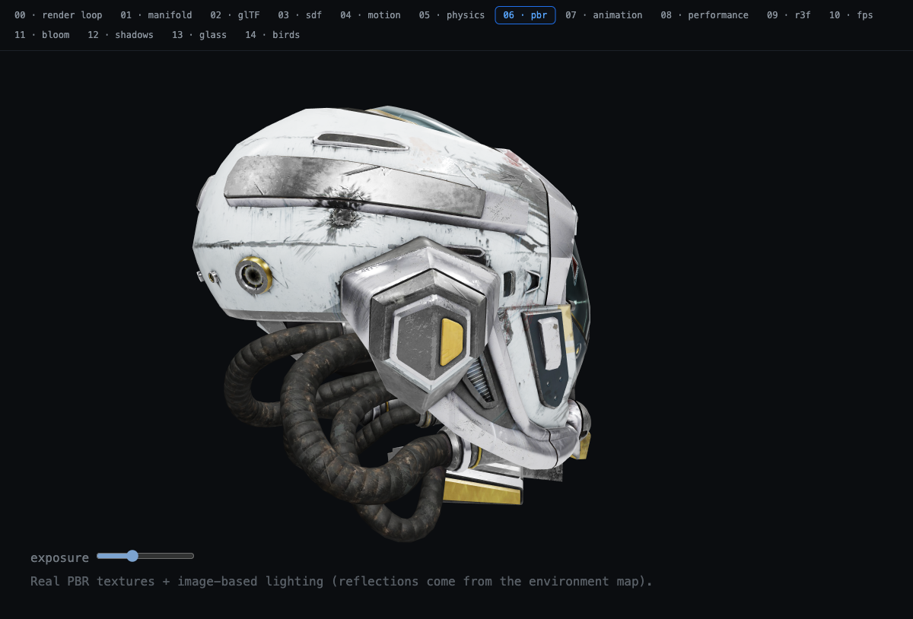
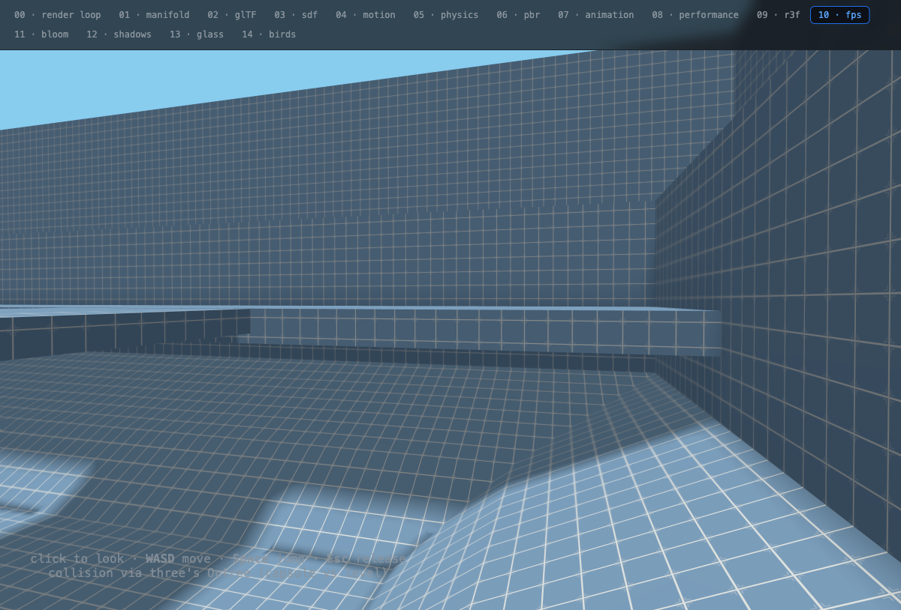
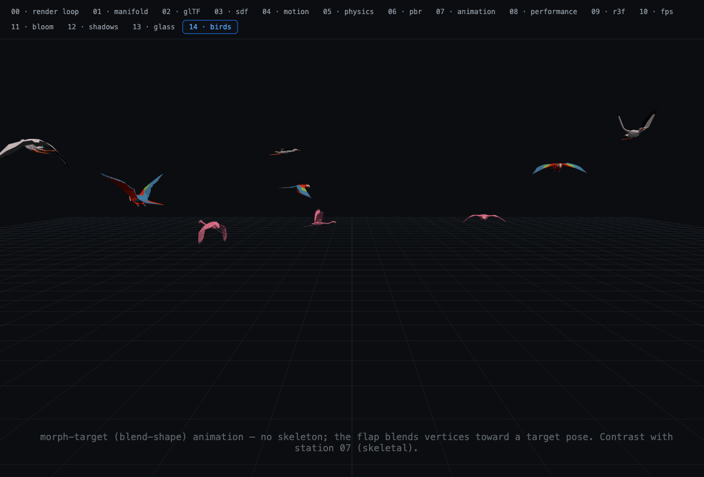
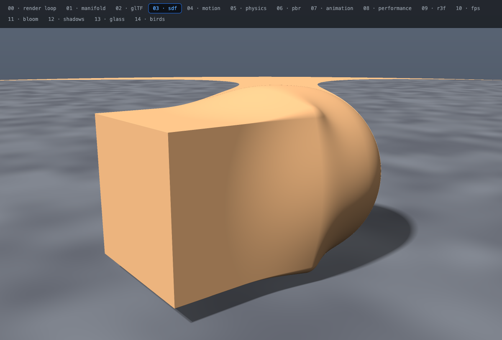
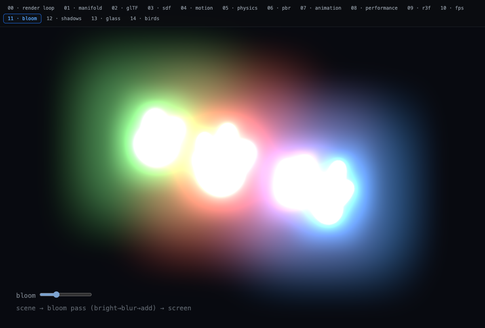
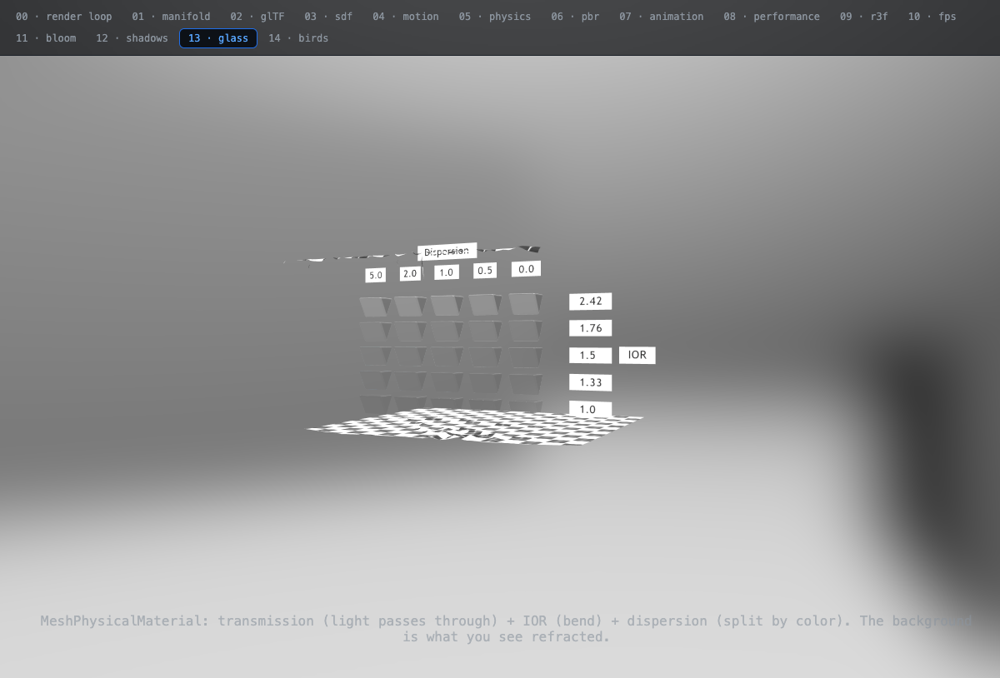

# stereo-lab

A hands-on playground for learning the core concepts behind a 3D motion framework
**by touching the code directly**. One Vite app; stations switch via the URL hash.

*A personal study / portfolio project — a learning lab, not a maintained open-source library.*

**▶ Live demo: https://kiyeonjeon21.github.io/stereo-lab/** — 15 interactive stations, no install.

<p align="center">
  
  
  
  <br />
  
  
  
</p>
<p align="center"><sub>PBR · walkable map · morph flock · SDF raymarching · bloom · glass</sub></p>

**Built with** three.js · TypeScript · Vite — plus manifold-3d (CAD kernel), gltf-transform,
Rapier (physics), Theatre.js (motion), three-mesh-bvh, and React Three Fiber. Each station is
one self-contained reading of a concept, paired with a code-grounded explanation in
[WALKTHROUGH.md](./WALKTHROUGH.md).

## Stations

The lab follows the pipeline of building 3D things. Stations 00–05 are the
**fundamentals** (toy data); 06–09 the **advanced layer** (real models, deeper tooling);
10–14 the **fun layer** (a walkable map + rendering effects).

> Foundation chain: **procedural generation → format/IO → render**
> manifold-3d (box·boolean·extrude) → gltf-transform (.glb export) → three.js (load·render).
> The same little "building" is touched three ways across 01–02.

| station | what it makes click |
| --- | --- |
| `#00-render-loop` | how the render loop turns — a spinning cube |
| `#01-manifold` | code = model: a WASM kernel emits vertex/index arrays; the renderer just consumes them |
| `#02-gltf` | the I/O layer: bake the same building to a .glb and load it back. glTF JSON tree in the console |
| `#03-sdf` | see the math: zero meshes — a fragment shader builds the scene via SDF raymarching. Drag to orbit |
| `#04-motion` | motion: wire a Theatre.js sheet/object onto a three.js mesh. Keyframe & scrub in the Studio panel |
| `#05-physics` | physics: Rapier (Rust→WASM). Fixed-timestep decouples the physics step from the render step. Click to drop boxes |
| `#06-pbr` | a real PBR model (DamagedHelmet) + environment map (IBL) + ACES tone mapping. Exposure slider |
| `#07-animation` | skeletal animation (Soldier). AnimationMixer + clip crossfade buttons |
| `#08-performance` | make it small (gltf-transform compression) + fast (three-mesh-bvh raycast). Hover picking |
| `#09-r3f` | station 06 rebuilt with R3F + drei — same scene, declarative abstraction (framework-author's view) |
| `#10-fps` | walkable map: collision-world.glb in first person (WASD + jump), capsule-vs-level collision via three's Octree, with shadows |
| `#11-bloom` | postprocessing: glow via EffectComposer + UnrealBloomPass. A pass chain |
| `#12-shadows` | shadows: a DirectionalLight shadow map (depth rendered from the light's view) + toggle |
| `#13-glass` | transmission/refraction: DispersionTest's transmission·IOR·dispersion, refracting the background |
| `#14-birds` | morph animation: a Flamingo/Parrot/Stork flock — vertex morph contrasted with skeletal (07) |

`buildBuilding()` in `src/lib/building.ts` shares the **same geometry logic** between the
browser station and the Node generator.

> For a line-by-line, code-grounded explanation of every station, see **[WALKTHROUGH.md](./WALKTHROUGH.md)**.

## Run

```bash
npm install
npm run gen:glb     # manifold → gltf-transform → public/models/building.glb
npm run dev         # http://localhost:5173 — switch stations from the top nav
```

`#02-gltf` needs `npm run gen:glb` first, or it has no model to load.

```bash
npm run build       # tsc typecheck + vite production build
npm run optimize    # (station 08) compress DamagedHelmet with gltf-transform + size report
npx gltf-transform inspect public/models/building.glb   # (bonus) inspect the generated asset
```

## Structure

```
scripts/build-glb.ts   # [station 02 generator] manifold → .glb in Node
src/
  main.ts              # hash router (dynamic station import + cleanup)
  lib/
    viewer.ts          # shared three.js bootstrap (scene/camera/renderer/controls/loop)
    manifold.ts        # WASM init + manifold → BufferGeometry conversion
    building.ts        # shared procedural geometry logic
  stations/*.ts        # each module follows the mount(container) => cleanup contract
```

## Notes

- `manifold-3d` is WASM, so it's loaded via the Vite `optimizeDeps.exclude` + `manifold.wasm?url` + `locateFile` pattern (see `src/lib/manifold.ts`, `vite.config.ts`). In Node, `locateFile` isn't needed.

## Credits

3D models are sample assets from the [three.js examples](https://github.com/mrdoob/three.js/tree/dev/examples/models/gltf)
and the [Khronos glTF Sample Assets](https://github.com/KhronosGroup/glTF-Sample-Assets)
(DamagedHelmet, Soldier, collision-world, DispersionTest, Flamingo/Parrot/Stork) — see those
repos for individual licenses/authors. All lab code is original.

## License & use

This is a personal learning/portfolio repo, shared so the code is readable and the demo is
playable. It's not packaged for reuse and isn't accepting contributions. Feel free to read,
run, and learn from it; the bundled third-party models keep their original licenses (see Credits).
